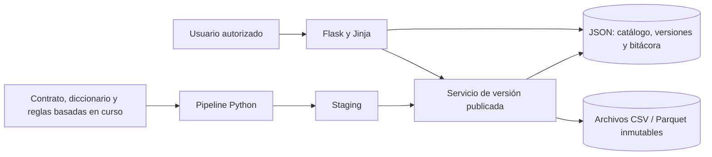

# Arquitectura Flask con persistencia JSON

## Decisión vigente

Por decisión del usuario, la persistencia de metadatos, bitácora y puntero de publicación se realiza en documentos JSON locales. No se usa PostgreSQL, SQLAlchemy ni Alembic. Los microdatos viven como archivos CSV/Parquet versionados; el JSON guarda hashes, linaje, estado de versiones y eventos, no registros de personas.

La aplicación web es Flask con vistas Jinja. El pipeline de datos se ejecuta como comando independiente para no bloquear solicitudes web. Los documentos JSON se escriben en archivo temporal y se reemplazan atómicamente; una exclusión mutua por archivo evita actualizaciones perdidas entre procesos locales. Los archivos de versión se crean en staging, se validan por hash y se renombran al área inmutable. Solo después el catálogo JSON cambia el puntero publicado y agrega el evento de publicación en una única escritura atómica.

## Componentes y persistencia

| Componente | Responsabilidad | Implementación |
|---|---|---|
| Flask | Presentar dashboard y bitácora, consultar el puntero vigente | `dashboard/`, blueprint Jinja |
| Pipeline | Leer solo `data/persona.csv`, perfilar, aplicar reglas justificadas y validar | `data/proprosessing/preprocessing.py` y notebook equivalente |
| Catálogo | Guardar `published_version_id`, versiones y eventos append-only | `data/audit_log.json` |
| Almacenamiento de versiones | Conservar corrida completa, manifiesto, CSV/Parquet y reportes | `data/proprosessing/versions/<version_id>/` |
| Candidatas | Salidas no publicadas del pipeline | `data/proprosessing/output/<run_id>/` |
| Pruebas | Verificar reglas, locks JSON, persistencia y publicación | `tests/`, datos sintéticos inventados |

El catálogo JSON usa un único documento para el evento de publicación y el puntero, para que ambos cambien en la misma sustitución atómica. Eventos nuevos se agregan a `events`; el programa no ofrece edición ni borrado de eventos. El lock local usa creación exclusiva de un archivo auxiliar. Si queda un lock huérfano tras una terminación abrupta, se debe revisar y retirar manualmente después de confirmar que no haya un proceso activo.

## Flujo de validación y publicación

1. Mantener `data/persona.csv` inmutable y calcular su SHA-256.
2. Generar una corrida nueva en `output/` sin sobrescribir corridas anteriores.
3. Validar esquema, dimensiones, clave, filas, transformaciones, bitácora de celdas y hashes de artefactos.
4. Copiar la corrida completa a un directorio staging bajo `versions/`, volver a comprobar todos los hashes y completar el manifiesto de publicación.
5. Renombrar staging a un directorio con el identificador lógico de versión, sin reemplazar una versión existente.
6. Bajo lock, escribir atómicamente `published_version_id`, la entrada de versión y `PUBLISH_VERSION` en `data/audit_log.json`.
7. Flask resuelve exclusivamente el identificador publicado desde JSON; no selecciona una corrida candidata por orden alfabético ni por fecha.

Si una validación falla, no se cambia el puntero. Si el proceso se interrumpe después del renombrado de archivos y antes de cambiar el JSON, queda un directorio huérfano que no es visible como publicado y puede reconciliarse. Una publicación repetida de la misma versión es idempotente. Un cambio posterior produce una nueva versión; no modifica la publicada anterior.

## Estados

- Corrida: `candidate` → `validated` → `published_internal_with_semantic_limitations`.
- Versiones anteriores: `superseded`; ejecuciones fallidas no mueven el puntero.
- Las limitaciones semánticas quedan en el manifiesto y en el registro JSON. Una publicación interna no certifica que todo dominio, salto o valor sea verdadero ni autoriza inferencia oficial.

## Alcance y límites de JSON

Este modo está diseñado para ejecución local, una instancia y volumen moderado. El lock por archivo serializa escrituras entre procesos del mismo equipo, pero JSON no ofrece transacciones distribuidas, consultas complejas, réplicas ni alta disponibilidad. Se deben hacer copias de seguridad coordinadas del catálogo y los artefactos, revisar permisos del directorio de datos y no escribir valores sensibles de celdas en la bitácora general. El catálogo registra referencias restringidas por ID/hash; la bitácora por celda existente queda en la corrida versionada con acceso controlado a archivos.

La API del prototipo no implementa todavía autenticación completa, autorización por rol, ciclo de propuestas/aprobaciones, copias restaurables probadas ni un worker persistente. No anunciar esas funciones como operativas. La persistencia JSON y el flujo local de publicación sí se prueban mediante tests sintéticos; Flask lee la versión indicada por el catálogo.
