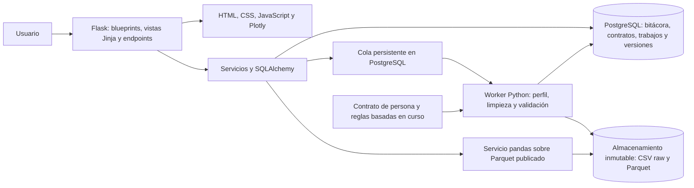

# Arquitectura del sistema Flask (por implementar)

## Principios

El sistema se centra en `persona.csv` y separa archivos originales, datos preparados, metadatos y resultados. Flask sirve las vistas y endpoints; PostgreSQL conserva la bitácora y las transacciones de metadatos. Cada ejecución identifica archivo, contrato, reglas, fundamento de `curso/` y versión de código. El dashboard lee únicamente la versión limpia publicada. Una falla no modifica lo que ven los usuarios.

La primera entrega usa un worker como proceso separado y trabajos persistidos en PostgreSQL. Debe reclamar trabajos con bloqueo transaccional, registrar intentos y recuperar trabajos interrumpidos sin duplicar la publicación. No ejecutar la limpieza del archivo de 34.568.646 bytes dentro de una petición HTTP ni depender de tareas en memoria del servidor Flask. Una cola independiente es una evolución posterior.

## Componentes

| Componente | Función | Tecnología inicial propuesta |
| --- | --- | --- |
| Interfaz web | Carga, calidad antes/después, dashboard y bitácora | Templates Jinja servidos por Flask, HTML/CSS, JavaScript y Plotly |
| Aplicación web | Autenticación, autorización, contratos, filtros, propuestas y exportaciones | Python, Flask, blueprints y servicios |
| Conexión y migraciones | Modelos, sesiones y transacciones | SQLAlchemy, controlador PostgreSQL y Alembic |
| Worker | Perfil, limpieza, validación, materialización y cálculos | Python y pandas; dependencias fijadas al implementar |
| Base transaccional | Cargas, reglas, impactos, decisiones, versiones y bitácora append-only | PostgreSQL |
| Almacenamiento | Archivos originales y salidas de cada versión | Sistema de archivos controlado en local; S3 compatible en producción |
| Servicio analítico | Filtros y agregaciones sobre versión limpia publicada | pandas sobre Parquet; límites y caché por versión |
| Observabilidad | Estado, duración, errores, métricas y alertas | Logs estructurados y métricas |

PostgreSQL administra la bitácora y las transacciones. Los microdatos de las 275 columnas permanecen en archivos versionados; una tabla de eventos no sustituye el dataset. Los parches manuales conservan clave, columna y valores protegidos; las reglas masivas conservan configuración, conteos e indicadores antes/después.

## Organización y conexión a base de datos

Usar una factoría `create_app`, configuración por entorno y blueprints de autenticación, importación, calidad, cambios, bitácora y dashboard. Las rutas llaman servicios; los servicios coordinan sesiones SQLAlchemy y no contienen credenciales. Versionar modelos y migraciones Alembic antes de cargar datos.

La conexión se configura con `DATABASE_URL`; el secreto de sesión con `SECRET_KEY`; el almacenamiento con `DATA_STORAGE_ROOT` relativo al proyecto o definido por entorno. Mantener un `.env.example` sin secretos. PostgreSQL es obligatorio para la bitácora de la primera entrega; una base en memoria no cumple persistencia. Separar la cuenta de migraciones de la cuenta de aplicación y restringir UPDATE/DELETE de eventos de auditoría. Las acciones web que modifican estado requieren autenticación, permisos y protección CSRF.

Una operación auditable debe confirmar sus metadatos y evento en la misma transacción. Si falla la conexión o la escritura de bitácora, no confirmar una corrección, publicación o exportación sensible. Cerrar sesiones y revertir transacciones ante errores. Los esquemas JSON de solicitudes/respuestas y la especificación OpenAPI se versionan explícitamente; Flask no los genera por esta documentación.

## Flujo de carga y preparación

1. El usuario autorizado registra fuente, finalidad y contrato de personas. Flask crea el trabajo `pipeline_run` con identificador y clave de idempotencia, y registra la solicitud en la bitácora.
2. El worker conserva el CSV exacto como raw, calcula SHA-256 y comprueba tamaño, codificación, delimitador y encabezados. Una solicitud repetida con la misma clave y contenido devuelve el trabajo existente; la misma clave con otro contenido produce conflicto. El mismo hash permite reutilizar el raw. Una ejecución nueva con otro contrato o reglas puede producir otra versión y queda auditada.
3. Un parser de CSV maneja comillas, saltos internos y codificación. Registra filas ilegibles en cuarentena con número de línea y motivo. El archivo original permanece intacto.
4. Se crea un perfil: tipos candidatos, nulos y tokens faltantes, cardinalidad, rangos, valores frecuentes, claves duplicadas, filas con errores y distribuciones. El perfil no transforma los datos.
5. El worker aplica reglas declaradas y versionadas según [la metodología](cleaning-methodology.md): tokens, tipado, dominios, duplicados, atípicos y correcciones aprobadas. La imputación exige justificación específica. Cada regla registra referencia del curso, universo, condición, acción, filas afectadas y métricas antes/después en PostgreSQL; los ejemplos visibles se enmascaran.
6. Se valida la salida: esquema, claves, dominios, conteos, invariantes y pruebas de reconciliación. Las filas rechazadas quedan en cuarentena; una política de calidad decide si bloquear o permitir publicación parcial.
7. Se materializa Parquet en una ruta temporal, se verifica hash y conteos y se mueve a ruta final inmutable. PostgreSQL cambia el puntero `published_version_id` en una transacción. Si algo falla, se conserva la versión previa.
8. Se calculan estadísticas y cachés por versión. La API invalida vistas antiguas; el dashboard muestra versión, fecha y estado.

## Flujo de edición

Una edición se propone sobre una versión base y una clave de registro estable. El servidor presenta el valor actual, valida el nuevo valor y genera un diff. Tras aprobación, el worker aplica el parche sobre una copia lógica de la versión base, ejecuta de nuevo las validaciones afectadas y crea otra versión. Si la versión publicada cambió o el valor anterior no coincide, la propuesta queda en conflicto y requiere revisión. Una restauración también crea una nueva versión.

## Estados de trabajo y versión

`pipeline_run`: `queued → running → profiled → validating → succeeded` o `failed/cancelled`. Un trabajo de solo perfil pasa de `profiled` a `succeeded` sin crear una versión limpia, dejando constancia del tipo de trabajo. Una versión: `draft → validated → published → superseded`. `rejected` y `failed` nunca se consultan como versión publicada. Cada transición tiene fecha, actor y motivo en PostgreSQL.

## Interfaces principales (propuesta)

| Método y ruta | Acción | Resultado |
| --- | --- | --- |
| `POST /datasets` | Registrar dataset y contrato | `dataset_id` |
| `POST /datasets/{id}/imports` | Cargar original y crear trabajo | `job_id` (202) |
| `GET /jobs/{id}` | Consultar estado y errores | Estado, progreso y contadores |
| `GET /datasets/{id}/versions` | Consultar linaje | Versiones y hashes |
| `GET /datasets/{id}/versions/{v}/profile` | Ver calidad | Perfil y excepciones |
| `POST /datasets/{id}/versions/{v}/publish` | Publicar versión validada | Versión publicada |
| `POST /datasets/{id}/changes` | Proponer parche | `change_request_id` |
| `POST /changes/{id}/decision` | Aprobar o rechazar | Decisión auditada |
| `POST /datasets/{id}/analyses` | Pedir cálculo con filtros | `analysis_id`/resultado |
| `GET /datasets/{id}/dashboard` | Leer métricas publicadas | Versión, definiciones, datos |
| `GET /datasets/{id}/audit` | Consultar bitácora con permisos y filtros | Eventos paginados por fecha, actor, regla y versión |
| `POST /datasets/{id}/exports` | Exportar versión/resultado | Trabajo y archivo autorizado |

Los endpoints se detallarán con OpenAPI al implementarlos. Usar paginación y filtros validados; limitar exportaciones y consultas costosas. Los trabajos largos devuelven 202 y un identificador.

## Despliegue inicial y evolución

Primera entrega: Flask con vistas Jinja, worker independiente, PostgreSQL y almacenamiento persistente; variables de entorno, migraciones y pruebas sintéticas. El servidor de desarrollo se reserva para desarrollo; el despliegue requiere servidor WSGI configurado para el entorno. Posteriormente: copias de seguridad verificadas, programación, almacenamiento S3 compatible y cola independiente. El despliegue no forma parte del estado actual del repositorio.
